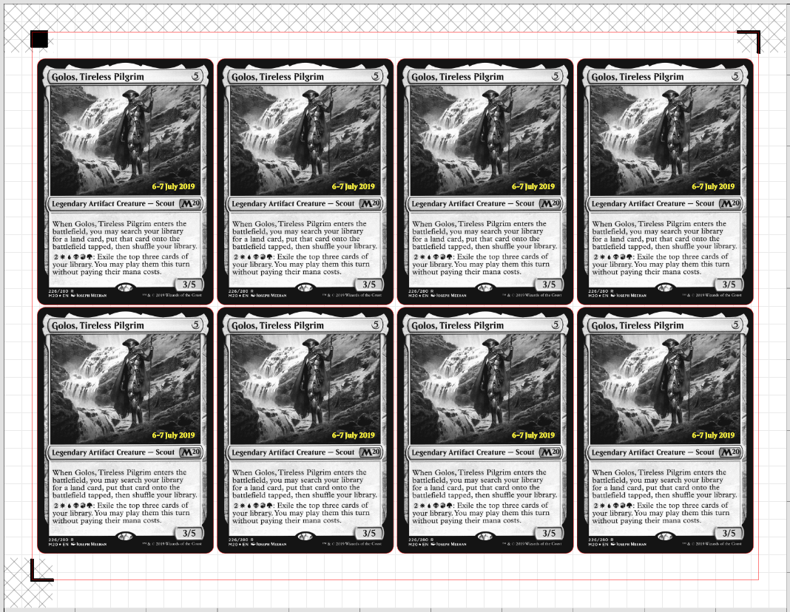
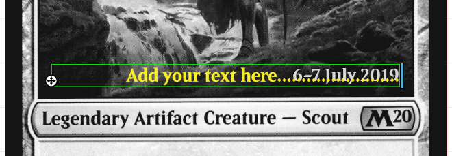
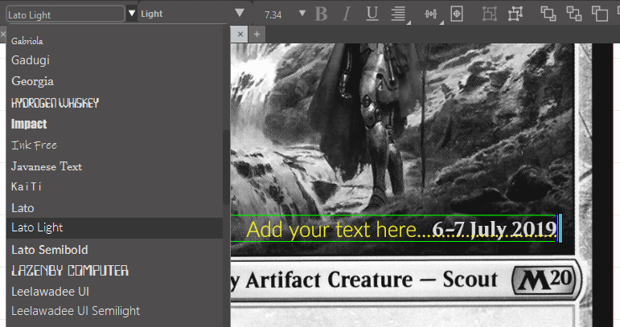

# MTG Prerelease Date Stamp

*Note: This tutorial is highly experimental. Your milelage may vary.*

For years, Wizards of the Coast produced prerelease cards with a date stamp. These prerelease cards have been discontinued but it is possible to replicate these stamps using a Silhouette cutting machine.

To replicate the date stamp, you can use a Silhouette heat pen, which can apply foil using a Silhouette Studio template.

You can apply foil to either proxies or genuine cards.

Additionally, you can use the Print and Cut feature to align the date stamp as well.

## Supply list

Silhouette heat pens are compatiable with Cameo 5, Cameo 5 Plus, Cameo Pro (Mark 2), Portrait 4, and Curio 2.

They come in three different sizes (coupon code: `DIYBOARDGAMES`):
* [Super fine (0.5 mm)](https://www.silhouetteamerica.com/heat-pen-super-fine-oxz?affiliate_code=uKx6VtFWmI&referring_service=link) 
* [Fine (1.0 mm)](https://www.silhouetteamerica.com/heat-pen-fine-mnk?affiliate_code=uKx6VtFWmI&referring_service=link)
* [Wide (2.5 mm)](https://www.silhouetteamerica.com/silhouette-heat-pen-wide-tip-25mm-xze?affiliate_code=uKx6VtFWmI&referring_service=link)

You can also purchase them in a [triple pack](https://www.silhouetteamerica.com/silhouette-heat-pen-set-of-3-super-fine-fine-wide-a1d?affiliate_code=uKx6VtFWmI&referring_service=link) which also includes gold and silver foil.

For creating the date stamp, there are a few caveats. 

Only the super fine can produce the fine details of Beleren font. However, the super fine is quite difficult to use. It easily rips the foil and produces inconsistent results.

If you are only planning on purchasing one heat pen, I recommend the fine. You will have to use a different font but it is much easier to use and generally more useful than the super fine for other foiling projects.

You also need foil (coupon code: `DIYBOARDGAMES`):
* [Gold](https://www.silhouetteamerica.com/FOIL-TRANS-GLD?affiliate_code=uKx6VtFWmI&referring_service=link) / [Amazon alternative](https://amzn.to/4keHzW5)
* [Silver](https://www.silhouetteamerica.com/FOIL-TRANS-SVR?affiliate_code=uKx6VtFWmI&referring_service=link) / [Amazon alternative](https://amzn.to/4kkoWjI)

## Contents

* [letter_standard_v4_prerelease.studio3](./letter_standard_v4_prerelease.studio3), a template for `letter` paper
* [a4_standard_v3_prerelease.studio3](./a4_standard_v3_prerelease.studio3), a template for `a4` paper
* [BELEREN-BOLD.TTF](./BELEREN-BOLD.TTF), Beleren font
* [BELERENSMALLCAPS-BOLD.TTF](./BELERENSMALLCAPS-BOLD.TTF), Beleren small caps font

## Instructions

### Install Beleren font 

As mentioned previously, if you have the super fine heat pen, you can try creating the date stamp using Beleren font. If you plan on using Beleren font, then you need to install it.

**macOS:**
1. Download [BELEREN-BOLD.TTF](./BELEREN-BOLD.TTF) and [BELERENSMALLCAPS-BOLD.TTF](./BELERENSMALLCAPS-BOLD.TTF).
2. Double click the font file.
3. A preview window will open in Font Book. Click Install at the bottom of the window.

**Windows:**
1. Download [BELEREN-BOLD.TTF](./BELEREN-BOLD.TTF) and [BELERENSMALLCAPS-BOLD.TTF](./BELERENSMALLCAPS-BOLD.TTF).
2. Right-click the font files (.ttf or .otf) and select Install.

**Linux:**
1. Download [BELEREN-BOLD.TTF](./BELEREN-BOLD.TTF) and [BELERENSMALLCAPS-BOLD.TTF](./BELERENSMALLCAPS-BOLD.TTF).
2. Right-click the font files and select "Open with Font Viewer" or similar, then click the "Install" button.

### Equip heat pen

On your cutting machine, install the heat pen on the powered tool carriage.

### Open design template

Open [letter_standard_v4_prerelease.studio3](./letter_standard_v4_prerelease.studio3) or [a4_standard_v3_prerelease.studio3](./a4_standard_v3_prerelease.studio3).

Double click on the date and change the date as desired.

If you are using the fine heat pen, choose a different font. I recommend something thing like *Lato Light*.

### Preheat the heat pen

Your cutting machine should automatically recognize that you have a heat pen installed.

However, you still need to manually preheat the heat pen before cutting.

...

### Prepare the sheet

You can apply the foil to either proxies or genuine cards.

To apply foil to genuine cards, apply a discarded cutting template to your cutting mat. This will be used to align the cards.

Put the cards into the holes of the discard cutting template.

Tape foil over the cards. The foil should be flat and free of wrinkles.

### Apply foil

After preheating has been completed, select the sketch action and start the job.
